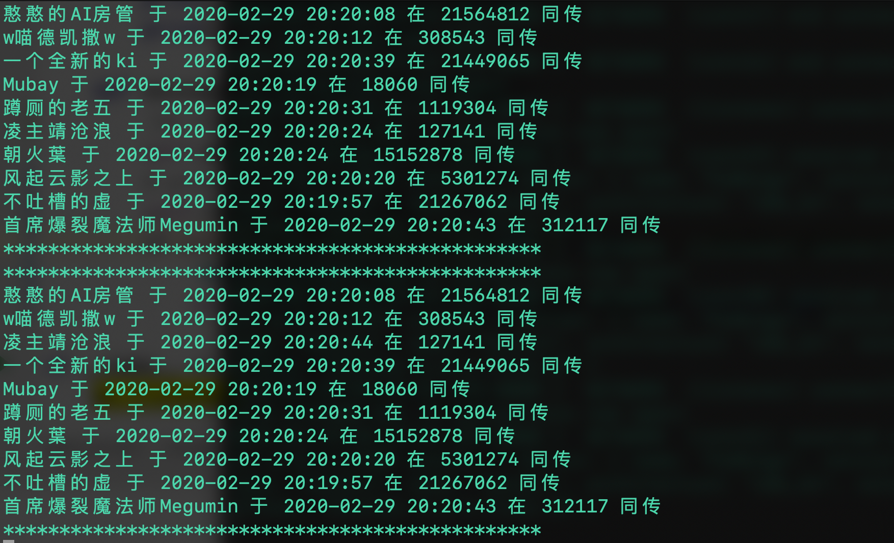

# DD_real_time_radar
Detect the danmaku data in realtime, then track the target Simultaneous interpretation man

本项目继承自：[bilibili-vtuber-live-danmaku-relay](https://github.com/dd-center/bilibili-vtuber-live-danmaku-relay)

1. ✅ 监听所有vtuber直播间弹幕 已完成 --- by Kinori
2. ✅ Python端构建数据库，并将弹幕信息插入 已完成 --- by pren1
3. ✅ 弹幕信息优化：仅需要字数信息 已完成 --- by pren1
4. ✅ 弹幕数实时排名/最后弹幕发言追踪 已完成 --- by pren1
5. ✅ 整合/后端命令行版本 建立一个demo 已完成 --- by pren1
6. ✅ 写文档 施工中 --- by pren1

☁️ Introduction
目前实现的功能有：实时创建同传排行榜（未考虑过去的数据）

<p>
    
</p>

⚡️ Quick start

1. 下载repo
```
git clone https://github.com/pren1/DD_real_time_radar.git
```
2. 安装mongodb
mac安装[教程](http://choskim.me/how-to-install-mongodb-on-apples-mac-os-x/)
3. 开启mongodb
```
mongod
```
4. 安装相关包
```
npm install
npm install --save express
```
5. 运行js服务器
```
node index.js
```
6. 运行python端程序
```
python3 python_ws_client.py
```


